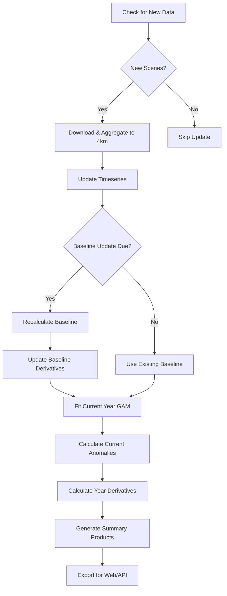

# Operational Drought Monitoring

**Purpose**: Automated, scalable drought monitoring from regional to CONUS scale
**Status**: Production-ready framework
**Created**: 2025-10-21

---

## Overview

This operational monitoring system provides automated weekly drought assessments using the GAM-based NDVI analysis developed in the base workflow. It's designed to scale from regional (Midwest DEWS) to CONUS-wide monitoring with minimal configuration changes.

### Key Features

✅ **Scalable**: Midwest → Great Plains → Western US → Full CONUS
✅ **Automated**: Scheduled weekly updates via cron
✅ **Incremental**: Only processes new data since last update
✅ **Adaptive**: Rolling baseline updates as new years complete
✅ **Resilient**: Checkpoint/resume, retry logic, logging
✅ **Multi-mode**: Full analysis, quick updates, data-only, conditions-only

---

## Directory Structure

```
operational_monitoring/
├── config/
│   ├── region_configs.R          # Regional configurations (Midwest, CONUS, etc.)
│   ├── midwest_operational.yaml  # Auto-generated config files
│   ├── conus_operational.yaml
│   └── ...
├── scripts/
│   ├── 01_update_recent_data.R   # Incremental data acquisition
│   ├── 02_update_rolling_baseline.R  # Baseline management
│   ├── 03_current_conditions.R   # Current drought assessment
│   └── run_operational_update.sh # Master automation script
├── logs/
│   └── [region]_update_[timestamp].log  # Execution logs
└── products/
    └── (symlinked to main data/web_products/)
```

---

## Quick Start

### 1. Initialize for Your Region

```r
# In R console or script
source("config/region_configs.R")

# Initialize Midwest (default)
config <- init_monitoring("midwest", "operational")

# Or initialize CONUS
config_conus <- init_monitoring("conus", "operational")

# Or create custom region
config_custom <- init_monitoring("custom", "operational")
# Edit the generated YAML file to set your bbox
```

### 2. Run First Update

```bash
# Navigate to operational_monitoring/scripts/
cd operational_monitoring/scripts/

# Full update (data + baseline + conditions)
./run_operational_update.sh midwest full

# Quick conditions check (skip derivatives)
./run_operational_update.sh midwest quick

# Data update only
./run_operational_update.sh midwest data-only
```

### 3. Schedule Automated Updates

```bash
# Add to crontab for weekly Monday morning updates
crontab -e

# Add this line (runs every Monday at 6 AM):
0 6 * * 1 /path/to/operational_monitoring/scripts/run_operational_update.sh midwest full >> /path/to/logs/cron.log 2>&1
```

---

## Available Regions

Pre-configured regions in `config/region_configs.R`:

### 1. Midwest DEWS (midwest)
- **States**: ND, SD, NE, KS, MN, IA, MO, WI, IL, IN, MI, OH
- **Bbox**: -104.5°W to -82.0°W, 37.0°N to 47.5°N
- **Pixels**: ~15,000 at 4km
- **Use case**: Regional drought early warning

### 2. Full CONUS (conus)
- **Coverage**: Continental United States (lower 48)
- **Bbox**: -125.0°W to -66.0°W, 24.0°N to 50.0°N
- **Pixels**: ~500,000 at 4km
- **Use case**: National-scale monitoring

### 3. Great Plains (great_plains)
- **States**: MT, ND, SD, WY, NE, KS, OK, TX
- **Bbox**: -106.0°W to -94.0°W, 33.0°N to 49.0°N
- **Pixels**: ~50,000 at 4km
- **Use case**: Agricultural drought monitoring

### 4. Western US (western)
- **States**: WA, OR, CA, ID, NV, UT, AZ, MT, WY, CO, NM
- **Bbox**: -125.0°W to -102.0°W, 31.0°N to 49.0°N
- **Pixels**: ~150,000 at 4km
- **Use case**: Western water resources

### 5. Custom (custom)
- **Setup**: Edit `config/custom_operational.yaml` after initialization
- **Required**: Set `bbox_latlon` to your area of interest
- **Optional**: Adjust resolution, baseline years, update frequency

---

## Operational Workflow

### Weekly Update Cycle



### Update Modes

**1. Full Update** (`full`)
- Downloads new data
- Checks/updates baseline if needed
- Calculates current conditions (anomalies + derivatives)
- Runtime: ~2-4 hours (Midwest), ~8-12 hours (CONUS)

**2. Quick Update** (`quick`)
- Uses existing data
- Calculates magnitude anomalies only (skip derivatives)
- Runtime: ~30 min (Midwest), ~2 hours (CONUS)

**3. Data-Only** (`data-only`)
- Downloads and processes new scenes
- Stops after updating timeseries
- Runtime: ~1-2 hours

**4. Conditions-Only** (`conditions-only`)
- Calculates current conditions from existing data
- No data download or baseline update
- Runtime: ~30-60 min

---

## Configuration Options

### Temporal Parameters

```yaml
update:
  lookback_days: 45              # How far back to check for new data
  min_scenes_per_update: 10      # Minimum scenes to trigger processing
  max_cloud_cover: 50            # Cloud cover threshold %
  buffer_days: 3                 # Overlap for robustness

baseline:
  recalculation_frequency: annual  # monthly, seasonal, annual, never
  min_baseline_years: 10           # Minimum for stable baseline
  rolling_window: false            # Use rolling N-year window?
  rolling_window_years: 10
  update_trigger: january          # When to recalculate
```

### Processing Parameters

```yaml
processing:
  parallel_cores: 7              # CPU cores to use
  chunk_size: 1000               # Pixels per batch
  memory_limit_gb: 32            # RAM constraint
  checkpoint_frequency: 100      # Checkpoint interval
  retry_failures: true
  max_retries: 3
```

### Product Generation

```yaml
products:
  generate_maps: true
  generate_timeseries: true
  generate_reports: true
  export_formats: [csv, geotiff, netcdf]
  retention_days: 730            # Keep products for 2 years
  archive_baseline: true         # Archive old baselines
```

### Optional Alerts

```yaml
alerts:
  enable: false                  # Enable automated alerts
  anomaly_threshold_zscore: -2.0 # Magnitude threshold
  area_threshold_pct: 10         # % of region affected
  persistence_days: 14           # Duration threshold
  email_recipients: null         # Email list
  webhook_url: null              # Slack/Teams webhook
```

---

## Output Products

### Current Conditions
**Location**: `data/web_products/current_conditions/`

- `latest_anomalies.csv`: Current NDVI anomalies (all pixels × days)
- `latest_summary.json`: Summary statistics and regional metrics
- `current_anomalies_YYYY-MM-DD.csv`: Dated archives
- `current_summary_YYYY-MM-DD.json`: Dated summaries

### Summary Metrics

Example `latest_summary.json`:
```json
{
  "date": "2025-10-21",
  "year": 2025,
  "yday": 294,
  "n_pixels_total": 14823,
  "mean_anomaly": -0.042,
  "median_anomaly": -0.038,
  "pct_below_normal": 67.3,
  "pct_sig_below": 23.4,
  "pct_extreme_low": 8.2,
  "pct_moderate_low": 15.2,
  "pct_normal": 68.1,
  "mean_greenup_shift": 3.2
}
```

### Logs
**Location**: `operational_monitoring/logs/`

- `[region]_update_[timestamp].log`: Full execution logs
- `[region]_update_log.csv`: Update history tracking

---

## Scaling from Midwest to CONUS

### Resource Requirements

| Region | Pixels | Data/Year | RAM | Cores | Runtime |
|--------|--------|-----------|-----|-------|---------|
| Midwest | 15K | ~20 GB | 16 GB | 4-8 | 2-4 hrs |
| Great Plains | 50K | ~60 GB | 32 GB | 8-16 | 6-8 hrs |
| Western US | 150K | ~180 GB | 64 GB | 16-32 | 12-18 hrs |
| Full CONUS | 500K | ~600 GB | 128 GB | 32-64 | 24-36 hrs |

### Transition Strategy

**Phase 1: Regional Development** (Current)
```bash
# Start with Midwest DEWS
./run_operational_update.sh midwest full
```

**Phase 2: Expand to Great Plains**
```bash
# Test on larger region
init_monitoring("great_plains", "operational")
./run_operational_update.sh great_plains full
```

**Phase 3: Western US**
```bash
# Add Western states
init_monitoring("western", "operational")
./run_operational_update.sh western full
```

**Phase 4: Full CONUS**
```bash
# Scale to national
init_monitoring("conus", "operational")
# Consider cloud compute resources for CONUS
./run_operational_update.sh conus full
```

### Parallelization for CONUS

For CONUS-scale processing, consider:

1. **Spatial Chunking**: Process by HLS tiles or geographic regions
2. **Cloud Computing**: AWS/GCP with 64+ cores, 256 GB RAM
3. **Distributed Processing**: Use Spark or Dask for massive parallelism
4. **Database Backend**: PostgreSQL/PostGIS instead of flat CSV files

---

## Automation Examples

### Cron Scheduling

```bash
# Weekly Monday 6 AM updates
0 6 * * 1 /path/to/run_operational_update.sh midwest full

# Daily quick checks
0 7 * * * /path/to/run_operational_update.sh midwest quick

# Monthly baseline updates (1st of each month)
0 2 1 * * cd /path/to/scripts && Rscript 02_update_rolling_baseline.R

# CONUS: Weekly Saturday night (long runtime)
0 20 * * 6 /path/to/run_operational_update.sh conus full
```

### Systemd Timer (Linux)

Create `/etc/systemd/system/drought-monitor.service`:
```ini
[Unit]
Description=Drought Monitoring Update
After=network.target

[Service]
Type=oneshot
User=malexander
WorkingDirectory=/home/malexander/r_projects/github/NDVI_drought_monitoring/operational_monitoring/scripts
ExecStart=/home/malexander/r_projects/github/NDVI_drought_monitoring/operational_monitoring/scripts/run_operational_update.sh midwest full
```

Create `/etc/systemd/system/drought-monitor.timer`:
```ini
[Unit]
Description=Weekly Drought Monitoring
Requires=drought-monitor.service

[Timer]
OnCalendar=Mon *-*-* 06:00:00
Persistent=true

[Install]
WantedBy=timers.target
```

Enable:
```bash
sudo systemctl enable drought-monitor.timer
sudo systemctl start drought-monitor.timer
```

### Docker Integration

If using Docker container:
```bash
# Add to crontab on host
0 6 * * 1 docker exec conus-hls-drought-monitor /workspace/operational_monitoring/scripts/run_operational_update.sh midwest full
```

---

## Monitoring and Maintenance

### Check Status

```bash
# View recent logs
tail -f logs/midwest_update_*.log

# Check update history
cat logs/midwest_update_log.csv

# View current conditions
cat ../data/web_products/current_conditions/latest_summary.json
```

### Troubleshooting

**No new data found**
- Check NASA CMR service status
- Verify network connectivity
- Confirm NASA Earthdata credentials

**Baseline update fails**
- Check disk space
- Verify all baseline years have data
- Review memory usage (`top` or `htop`)

**Current conditions missing**
- Ensure baseline exists
- Check if current year has minimum observations
- Verify timeseries file is up to date

### Maintenance Schedule

- **Weekly**: Monitor update logs for errors
- **Monthly**: Review disk usage, clean old products
- **Quarterly**: Validate output accuracy against USDM
- **Annually**: Update baseline (if using rolling window)

---

## Integration with Web Services

### API Endpoint Example

```python
# Flask API to serve current conditions
from flask import Flask, jsonify
import json

app = Flask(__name__)

@app.route('/api/current_conditions/<region>')
def get_conditions(region):
    path = f'data/web_products/current_conditions/latest_summary.json'
    with open(path) as f:
        data = json.load(f)
    return jsonify(data)

@app.route('/api/anomalies/<region>')
def get_anomalies(region):
    import pandas as pd
    df = pd.read_csv('data/web_products/current_conditions/latest_anomalies.csv')
    return jsonify(df.to_dict(orient='records'))
```

### GeoServer Integration

Publish GeoTIFFs from `anomaly_products/` as WMS layers for web mapping.

---

## Future Enhancements

### Short-term
- [ ] NASA CMR API integration for automated discovery
- [ ] GeoTIFF export for spatial products
- [ ] Email/Slack alert system
- [ ] Web dashboard for visualization

### Medium-term
- [ ] Sub-seasonal forecasting integration
- [ ] USDM validation pipeline
- [ ] Multi-sensor fusion (MODIS, VIIRS)
- [ ] Cloud-optimized GeoTIFF outputs

### Long-term
- [ ] Machine learning drought prediction
- [ ] Climate model downscaling
- [ ] Agricultural yield integration
- [ ] Real-time streaming updates

---

## Support and Documentation

- **Base workflow**: See `CONUS_HLS_drought_monitoring/README_WORKFLOW.md`
- **GAM methodology**: See `CLAUDE.md` in main directory
- **Configuration options**: See `config/region_configs.R` comments
- **Issue tracking**: GitHub Issues (link TBD)

---

**Last Updated**: 2025-10-21
**Version**: 1.0
**Status**: Production-ready framework
